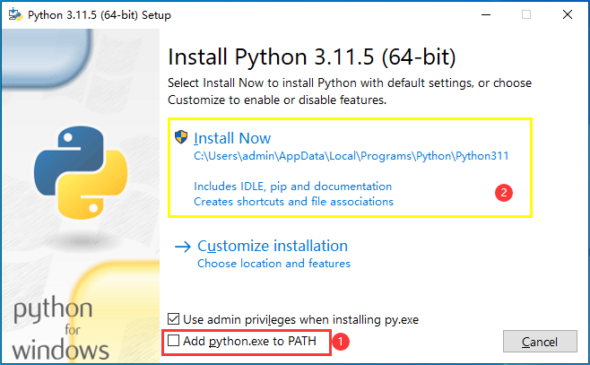
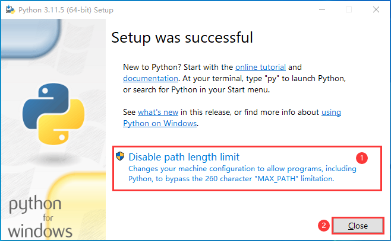

# **python 安装引导 (简体中文)**
## **第一步**
1. 勾选 "Add python.exe to PATH"
2. 选择 "Install Now"

## **第二步**
请耐心等待python安装。安装过程中python安装程序可能会申请管理员权限，请允许

## **第三步**
1. 选择 "Disable path length limit"(如果出现申请管理员权限，请允许)
2. 点击 "Close"

### **您已经在您的电脑上安装了python**
现在请点击浏览器的关闭按钮关闭该页面。
